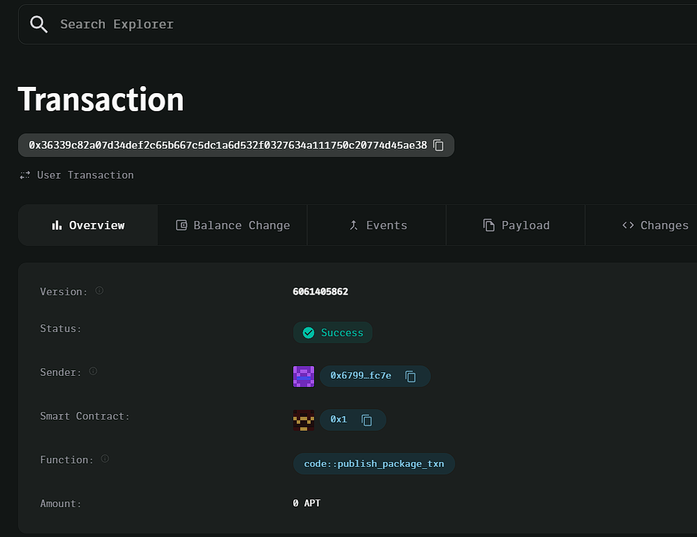

### Deployed smartcontract address: 0x36339c82a07d34def2c65b667c5dc1a6d532f0327634a111750c20774d45ae38

### Screenshot: 

# Decentralized Study Timer

## Project Title
Decentralized Study Timer

## Project Description
Decentralized Study Timer is a blockchain-based application designed to help students track their study sessions and reward them for staying focused. Students can start a study session, and upon completion, they are rewarded with tokens based on the amount of time spent studying.

## Vision
The goal of the Decentralized Study Timer is to encourage productive study habits by utilizing blockchain technology. By rewarding students with tokens, the platform fosters motivation and accountability, helping users stay focused on their tasks.

## Key Features
- **Study Session Tracking**: The application allows users to start a study session by recording the start time on the blockchain.
- **Token Rewards**: Students receive token rewards based on the time spent studying. Rewards are transferred securely and transparently using smart contracts.
- **Decentralized Storage**: Study sessions and rewards are tracked and managed on the blockchain, ensuring transparency and immutability.

## Future Scope
- **Custom Reward System**: Allow educators or institutions to set custom reward rates based on the subject or difficulty of the study session.
- **Leaderboard**: Implement a global or group leaderboard to track study hours and encourage competition among students.
- **Integration with Other Educational Platforms**: Extend the platform’s functionality by integrating with existing online learning systems, providing a seamless experience for students.
- **NFT Badges**: Issue NFT-based badges for achieving specific study milestones to further motivate students.

